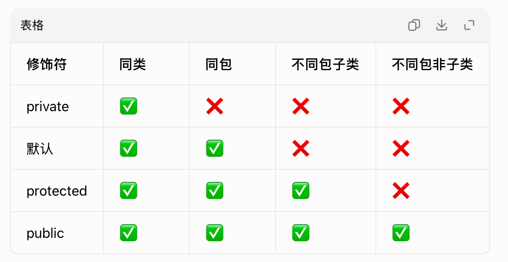
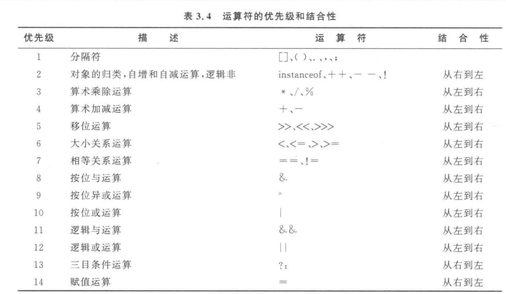

## 考试题型（初步）

- 单选题（30分，共30题）
- 多选题（10分，共5题）
- 判断题（10分）
- 简答题（主要考核心概念的深入理解）（20分，共2题）
- 编程题（30分，共三题）

!!! 注意
    重点复习前六章，七八章了解

<!-- 考察范围前八章，其中第七章拟涉及内部类和异常类，第八章涉及String类，正则表达式，Scanner类，BigInteger类与Random类。 -->

## Java变量命名规则

1. 可以包含字母，数字，`_`，`$`
2. 不可以包含Java中的关键字
3. 不能以数字开头
4. Java区分大小写

变量命名方法

驼峰命名法（Camel Case）： 在变量名中使用驼峰命名法，即将每个单词的首字母大写，除了第一个单词外，其余单词的首字母都采用大写形式。例如：myVariableName。

静态类变量通常也可以使用大写蛇形命名法，全大写字母，单词之间用下划线分隔。

类名称命名方法：首字母大写且每个单词的首字母都大写

## 数据类型

### 基本数据类型

整数类型

| 类型  | 字节  | 大致范围 | 精确范围 |
| ----- | ----- | -------- | -------- |
| byte  | 1字节 | -128 ~ 127 | $-2^{7} \sim 2^{7}-1$ |
| short | 2字节 | -3.2万 ~ 3.2万 | $-2^{15} \sim 2^{15}-1$ |
| int   | 4字节 | -21亿 ~ 21亿 | $-2^{31} \sim 2^{31}-1$ |
| long  | 8字节 | $-9 \times 10^{18} \sim 9 \times 10^{18}$ | $-2^{63} \sim 2^{63}-1$ |

浮点类型

| 类型   | 字节  | 大致范围 | 精确范围 |
| ------ | ----- | -------- | -------- |
| float  | 4字节 | $\pm 3.4 \times 10^{38}$ | 约6-7位有效数字 |
| double | 8字节 | $\pm 1.8 \times 10^{308}$ | 约15-16位有效数字 |

字符类型

| 类型 | 字节  |
| ---- | ----- |
| char | 2字节 |

布尔类型

`boolean` 类型只有两个值：`true` 和 `false`。占用空间取决于 JVM 实现，默认值为 `false`。

### 引用数据类型

#### 引用类型的特点

1. 必须`new`才能创建真正的对象
2. 默认值为`null`
3. 两个引用可以指向同一个对象
4. 调用方法时引用类型传的是地址

#### 数组

创建数组的方式：

1. 创建定长数组(动态初始化数组)

```java
//该情况下给所有元素赋默认值为0
int [] num = new int[1000];
```

2. 创建指定元素的数组（静态初始化数组）

```java
int [] nums = {1,2,3,4,5}; // 方法一
// 方法一只有声明变量的同时对变量进行赋值的时候可以使用
// 先声明变量再对变量进行赋值必须使用下面的这种方式
int [] nums;
nums = new int[]{1,2,3,4,5};

int [] nums = new int[]{1,2,3,4,5};
```

`int [] nums` 与 `int nums []`本质上是完全一样的后者更偏向于C/C++的风格

!!! danger
    ```java
    int [] a,b;
    // a 与 b 均为int数组
    int a [],b;
    // a 为 int 数组,b为int
    ```

声明二维数组

```java
int [][] arr = new int[10][10];
int [][] a;
a = new int[][]{
    {1,2},
    {2,3}
};
// 每一行的长度可以不同，但是不可以是列
int [][] arr = {
    {1,2,3},
    {4,5},
    {6,7,8,9}
};

int [][] arr =new int [][] {
    {1,2,3},
    {4,5},
    {6,7,8,9}
};

int [][] arr = new int[3][];
arr[0] = new int[3];
arr[1] = new int[2];
arr[2] = new int[4];
```


!!! note
    类对象、接口详细讲解见下面的[面向对象编程](#oop)部分。

    枚举、注解期末考试考不到。

### 强制类型转换

强制类型转换就是手动将一种变量/值的数据类型转换成另一种数据类型，大范围类型转换成小范围类型（会有可能产生精度损失的情况，），数据范围小的类型会自动转换成数据范围大的类型叫做自动类型转换。


```java
int a = (int)1e5; //强制类型转换
double b = 100; //自动类型转换
```
## 修饰符

### 访问控制修饰符

访问修饰符



<!-- | 修饰符    | 说明                                                               |
| --------- | ------------------------------------------------------------------ |
| public    | 对所有类可见。使用对象：类、接口、变量、方法                       |
| private   | 在同一类内可见。使用对象：变量、方法。                             |
| protected | 对同一包内的类和所有子类可见。使用对象：变量、方法。               |
| default   | 在同一包内可见，不使用任何修饰符。使用对象：类、接口、变量、方法。 | -->

### 非访问修饰符

`static` 静态变量、静态方法
`abstract` 抽象类、抽象方法

`final` 修饰类、成员变量、方法中的局部变量

final类不能被继承不能有子类
如果final修饰父类中的一个方法那么这个方法不允许子类重写
如果成员变量或者局部变量被修饰为final就是常量

--- 

## 运算符与表达式

`+`、`-`、`*`、`/`、`++`、`--`、`=`等常见的运算符不再讲解


**运算符的优先级：**

<!-- - 一级：`()`、`[]`、`.`（括号、数组下标、成员访问）
- 二级：`!`、`~`、`++`、`--`（一元运算符）
- 三级：`*`、`/`、`%`
- 四级：`+`、`-` -->

运算符的优先级如下：




**1.赋值运算符：**

- `=` 基本赋值，如 `int a = 10;`
- `+=`、`-=`、`*=`、`/=`、`%=` 复合赋值，如 `a += 5;` 等价于 `a = a + 5;`

**2.逻辑运算符：**

- 逻辑与`&&`
- 逻辑或`||`
- 逻辑非`!`

!!! note
    逻辑与与逻辑或也称为短路运算符

**3.位运算符：**

- 按位与`&`
- 按位或`|`
- 按位异或`^`
- 按位非`~`

**4.`instanceof`运算符**

是二目运算符，左面的操作元是一个对象；右面是一个类。当左面的对象是右面的类或子类创建的对象时，该运算符运算的结果是true ，否则是false。

**5.关系运算符**

对于==只能判断基本数据类型是否相等然后返回布尔值
对于引用类型的判断需要使用`var_name1.equals(var_name2)`的形式进行判断

**6.算数运算符**

加、减、乘、除、求余、自增、自减 

**7.三目运算符**

格式：`条件 ? 表达式1 : 表达式2`，条件为 `true` 时返回表达式1的值，否则返回表达式2的值。

```java
int max = a > b ? a : b;  // 取 a 和 b 中的较大值
```

## 输入与输出

读取输入的示例：

```java
import java.util.Scanner;

public class Main {
    public static void main(String[] args) {
        Scanner in =  new Scanner(System.in);
        byte a = in.nextByte();
        int b = in.nextInt();
        double c = in.nextDouble();
        float d = in.nextFloat();
        long e = in.nextLong();
        char f = in.next().charAt(0); //注意Java中没有直接读取单个字符的方法
        String s = in.next();
        String s1 = in.nextLine(); // 与next()的区别见下方讲解
        in.close();
    }
}
```

输出示例：
```java
public class Main {
    public static void main(String[] args) {
        int a = 10;
        System.out.println("字符串"+"拼接"); // 会自带换行
        System.out.print("H\n"); // 不自带换行
        System.out.printf("H%d\n",a); // 格式化输出
        double b = 13.234;
        System.out.printf("%8.2f\n",b); // 默认是六位小数
        System.out.printf("%-8.2f\n",b);

        // println与print字符串拼接用+，printf用占位符
    }
}
```

## 循环结构

`for`循环语句

```java
for(初始化;布尔表达式;更新条件){
    //循环语句，只有一句的时候可以省略花括号
}

for(int i = 0;i < 3;i++){
    System.out.println(i);
}
/**
 * 该代码的执行顺序如下：
 * 先进行初始化 i = 0
 * 
 * 判断 0 < 3 返回 true
 * 执行循环体 打印0并换行
 * 执行更新语句 i = 1
 * 
 * 判断 1 < 2 返回 true
 * 执行循环体 打印1并换行
 * 执行更新语句 i = 2
 * 
 * 判断 2 < 2 返回 false
 * 结束循环
 */
```

`for-each`循环（增强`for`循环）

```java
for(声明语句:表达式){
    // 循环体
}

int [] nums; // 声明变量
nums = new int[]{1,2,3,4,5}; // 对变量进行赋值

for(int x: nums){
    System.out.println(x);
}

String [] str_arr = {"abc","def","test"};

for(String s:str_arr){
    System.out.println(s);
}
```

`while`循环

```java
while(布尔表达式){
    //循环体
}

int a = 0;
while(true){
    if(a>10){
        a += 10;
        break;
    }
    a += a;
}
```

`do while`循环至少会执行一次循环体

```java
int a = 1;
do{
    a += 10;
}while(a<=10);
System.out.println(a); // 输出结果为11
```
!!! tips
    <mark>break</mark>结束整个循环，<mark>continue</mark>结束当前循环

    且<mark>break</mark> 还可以用于switch语句


## 条件语句

理解下面的三种情况即可

```java
int a = 0;
//情况一
if(a>0){
    System.out.println(a);
}
if(a>10){
    System.out.println(a);
}
//情况二
if(a>0&&a<10){
    System.out.println(a);
}else if(a>=100){
    System.out.println(a);
}
//情况三
if(a>=5){
    System.out.println(a);
}else if(a < 0){
    System.out.println(a);
}else {
    System.out.println(a);
}
```
!!! tip
    在C语言、C++中循环以及`if`语句的判断中如果是`0`则结束循环，但是在Java中必须是使用布尔值或者能够返回布尔值的表达式
## 分支语句

## 面向对象编程OOP {#oop}

### 成员变量与局部变量

- 成员变量有默认值但是局部变量没有默认值因此使用局部变量之前必须保证局部变量有具体的值
- 当局部变量名与成员变量名相同的时候，则成员变量暂时被隐藏（如果想使用成员变量必须使用this关键字）
- 对成员变量的操作只能放在方法中

### 成员方法

### 构造方法

- 方法名必须与类名完全相同，而且没有类型
- 允许存在若干个构造方法但是必须保证参数类型不同或者参数的数目不同
- 构造方法用于初始化各个成员变量

### 方法重载与多态

**多态：**父类的某个方法被其子类重写的时候可以产生各自的功能行为

### this关键字

### 对象数组

### ~~var局部变量~~[^1]

- 会自动进行变量类型推断
- 不能用var声明成员变量
- 必须指定初始值
- 方法的参数和方法的返回类型不能用var声明

### ~~jar文件~~[^1]

文档性质的jar文件

可运行的jar文件

### 创建对象

```java
Person per = new Person();
```
左边为引用类型（编译时类型）决定了可以调用那些方法跟属性

右边为对象类型（运行时类型）堆内存中真正创建的对象，程序运行时实际上是执行的这个逻辑

场景一：普通类引用（左右一样）
```java
class Person {
    public void say() {
        System.out.println("我是人");
    }
}

// 左右类型相同
Person p = new Person();
p.say(); 
```
引用和对象是同一个类，能调用该类所有非私有成员，编译、运行完全一致。

场景二：父子类（向上转型）

```java
// 父类
class Person {
    public void say() {
        System.out.println("父类：我是人");
    }
    public void work() {
        System.out.println("父类：工作");
    }
}

// 子类 Student 继承 Person
class Student extends Person {
    // 重写父类方法
    @Override
    public void say() {
        System.out.println("子类：我是学生");
    }
    // 子类独有方法
    public void study() {
        System.out.println("子类：学习");
    }
}
```
1.成员方法编译看左边，运行看右边
2.成员变量不存在重写编译运行都看左边
调用对象的方法
```java
p.say();   // 编译看Person有say()，运行执行Student的say()
// 输出：子类：我是学生

p.work();  // 子类没有重写，执行父类原方法
// 输出：父类：工作
p.study();
//编译错误

//向下转型（强制类型转换）
Student s = (Student) p;
s.study(); // 正常调用

class Person {
    String name = "人类";
}
class Student extends Person {
    String name = "学生";
}

Person p = new Student();
System.out.println(p.name); // 输出：人类（只看左边父类）
```
场景三：接口+实现类


### 子类与继承

Java不支持多重继承（子类只能有一个父类）

```java
class son extends father{

}
```

### 抽象类与抽象方法

```java
public abstract class Animal {

    // 抽象类可以有普通成员变量
    String name;

    // 抽象类可以有构造方法（用于子类调用）
    public Animal(String name) {
        this.name = name;
    }

    // 2. 抽象方法：只有声明，没有实现，必须用 abstract
    // 子类必须重写这个方法！
    public abstract void makeSound();

    // 3. 抽象类可以有普通方法（有具体实现）
    public void eat() {
        System.out.println(name + " 在吃东西");
    }
}
```

```java
public class Dog extends Animal {

    // 子类构造方法要先调用父类构造
    public Dog(String name) {
        super(name);
    }

    // 必须重写抽象方法
    @Override
    public void makeSound() {
        System.out.println(name + " 汪汪叫");
    }
}
```

```java
public class Cat extends Animal {

    public Cat(String name) {
        super(name);
    }

    @Override
    public void makeSound() {
        System.out.println(name + " 喵喵叫");
    }
}
```

```java
public class TestAbstract {
    public static void main(String[] args) {

        // 错误！抽象类不能直接实例化
        // Animal animal = new Animal("动物");

        // 正确：用子类实例化
        Animal dog = new Dog("旺财");
        Animal cat = new Cat("咪咪");

        dog.makeSound();
        cat.makeSound();

        dog.eat();
        cat.eat();
    }
}
```

### 开闭原则

对扩展开放，对修改关闭

### 接口

Java一个子类只能有一个父类（单继承）

但是一个类可以实现多个接口

### 抛出异常

### 基本类型的封装包装类

### 内部类

### Lambda表达式

Lambda表达式也称为闭包

语法格式如下：
```java
(parameters)->{statements;}
// parameters是参数列表 
(parameters)->expression
```

如果只有一个参数则可以省略括号，如果没有参数则必须使用空括号

## 常用实用类

## 正则表达式

- 校验数据格式是否合法
- 在一段文本中查找满足要求的内容

### 常用元字符

| 元字符 | 含义 |
|--------|------|
| `.` | 匹配任意单个字符（除换行符） |
| `\d` | 匹配数字 `[0-9]` |
| `\D` | 匹配非数字 |
| `\w` | 匹配字母、数字、下划线 `[a-zA-Z0-9_]` |
| `\W` | 匹配非单词字符 |
| `\s` | 匹配空白字符（空格、制表符、换行等） |
| `\S` | 匹配非空白字符 |
| `^` | 匹配字符串开头 |
| `$` | 匹配字符串结尾 |
| `\b` | 匹配单词边界 |

### 常用量词

| 量词 | 含义 |
|------|------|
| `*` | 匹配前一个字符 0 次或多次 |
| `+` | 匹配前一个字符 1 次或多次 |
| `?` | 匹配前一个字符 0 次或 1 次 |
| `{n}` | 匹配前一个字符恰好 n 次 |
| `{n,}` | 匹配前一个字符至少 n 次 |
| `{n,m}` | 匹配前一个字符 n 到 m 次 |

### 常用方括号表达式

| 表达式 | 含义 |
|--------|------|
| `[abc]` | 匹配 a、b 或 c 中的任意一个 |
| `[^abc]` | 匹配除 a、b、c 之外的任意字符 |
| `[a-z]` | 匹配 a 到 z 之间的任意小写字母 |
| `[A-Z]` | 匹配 A 到 Z 之间的任意大写字母 |
| `[0-9]` | 匹配 0 到 9 之间的任意数字 |

### 常用正则表达式示例

```
手机号：       ^1[3-9]\d{9}$
邮箱：         ^\w+@[a-zA-Z0-9]+(\.[a-zA-Z]{2,})+$
身份证号：     ^[1-9]\d{5}(18|19|20)\d{2}(0[1-9]|1[0-2])(0[1-9]|[12]\d|3[01])\d{3}[\dXx]$
IP地址：       ^((25[0-5]|2[0-4]\d|[01]?\d\d?)\.){3}(25[0-5]|2[0-4]\d|[01]?\d\d?)$
URL：          ^https?://[^\s/$.?#].[^\s]*$
日期(yyyy-MM-dd)： ^\d{4}-(0[1-9]|1[0-2])-(0[1-9]|[12]\d|3[01])$
中文字符：     ^[一-龥]+$
强密码(至少8位,含大写/小写/数字/特殊字符)： ^(?=.*[A-Z])(?=.*[a-z])(?=.*\d)(?=.*[\W_]).{8,}$
正整数：       ^[1-9]\d*$
浮点数：       ^-?\d+(\.\d+)?$
邮政编码：     ^[1-9]\d{5}$
QQ号：         ^[1-9]\d{4,10}$
车牌号(新能源)： ^[京津沪渝冀豫云辽黑湘皖鲁新苏浙赣鄂桂甘晋蒙陕吉闽贵粤川青藏琼宁][A-Z][A-HJ-NP-Z]?[DF][A-HJ-NP-Z0-9]{4,5}$
```

### Java 中使用正则表达式

Java 提供了 `java.util.regex` 包来处理正则表达式，主要有 `Pattern` 和 `Matcher` 两个类。

**方式一：使用 `String.matches()`（简单校验）**

```java
// 校验手机号
String phone = "13800138000";
boolean isPhone = phone.matches("^1[3-9]\\d{9}$"); // true

// 校验邮箱
String email = "test@example.com";
boolean isEmail = email.matches("^\\w+@[a-zA-Z0-9]+(\\.[a-zA-Z]{2,})+$"); // true
```

!!! warning "注意"
    在 Java 字符串中，反斜杠 `\` 需要转义，因此 `\d` 要写成 `\\d`，`\.` 要写成 `\\.`。

**方式二：使用 `Pattern` 和 `Matcher`（复杂操作）**

```java
import java.util.regex.Matcher;
import java.util.regex.Pattern;

// 1. 编译正则表达式
Pattern pattern = Pattern.compile("\\d+");

// 2. 创建匹配器
Matcher matcher = pattern.matcher("abc123def456");

// 3. 查找匹配
while (matcher.find()) {
    System.out.println("找到数字: " + matcher.group() + "，位置: " + matcher.start());
}
// 输出：
// 找到数字: 123，位置: 3
// 找到数字: 456，位置: 9
```

**常用 `Matcher` 方法**

| 方法 | 说明 |
|------|------|
| `matches()` | 整个字符串是否完全匹配正则 |
| `find()` | 查找下一个匹配的子序列 |
| `group()` | 返回匹配到的子序列 |
| `start()` | 返回匹配子串的起始索引 |
| `end()` | 返回匹配子串的结束索引（不包含） |
| `replaceAll(replacement)` | 将所有匹配替换为指定字符串 |
| `replaceFirst(replacement)` | 将第一个匹配替换为指定字符串 |

**分组提取信息**

```java
// 从日志中提取日期、级别和消息
String log = "2025-06-18 ERROR 数据库连接超时";
Pattern pattern = Pattern.compile("(\\d{4}-\\d{2}-\\d{2})\\s+(\\w+)\\s+(.+)");
Matcher matcher = pattern.matcher(log);

if (matcher.matches()) {
    System.out.println("日期: " + matcher.group(1));   // 2025-06-18
    System.out.println("级别: " + matcher.group(2));   // ERROR
    System.out.println("消息: " + matcher.group(3));   // 数据库连接超时
}
```

**替换与分割**

```java
// 替换所有数字为 #
String result = "abc123def456".replaceAll("\\d", "#");
System.out.println(result); // abc###def###

// 按非单词字符分割
String[] parts = "hello,world;java".split("[;,]");
// 结果: ["hello", "world", "java"]
```
[正则表达式练习代码](../../downloads/zhengze.zip){ .md-button .md-button--primary }

## 常用算法思想技巧


[^1]: 意思就是这个感觉不是特别重要了解即可

!!! quote
    <!-- 本页内容部分来来自于[菜鸟教程](https://www.runoob.com/java/java-tutorial.html) -->
    本页的部分内容引用其他网站内容
