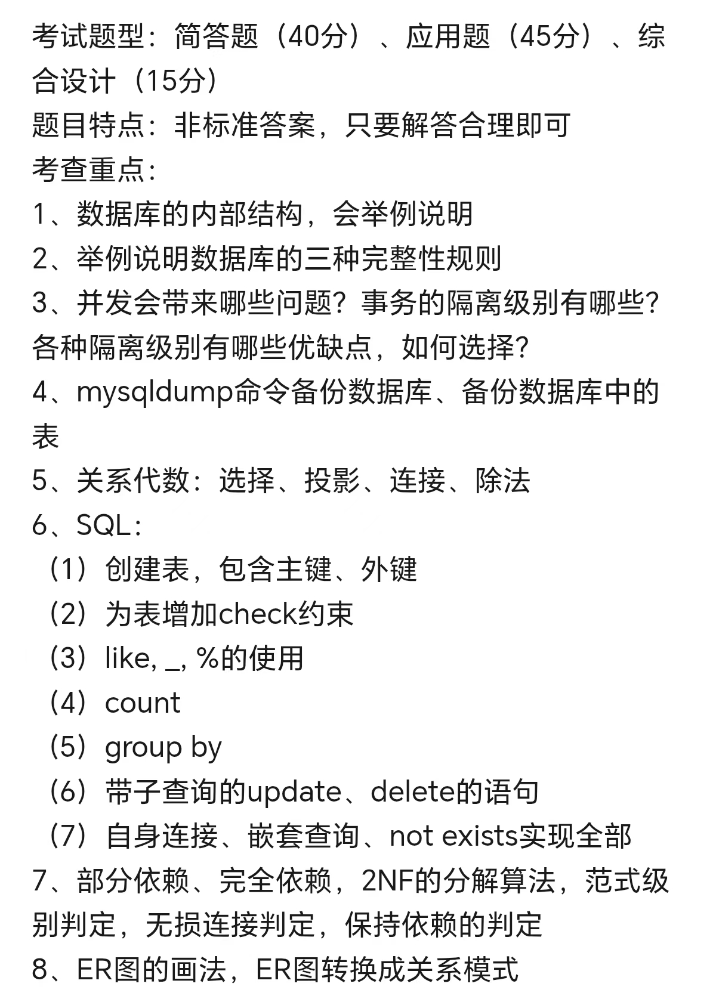
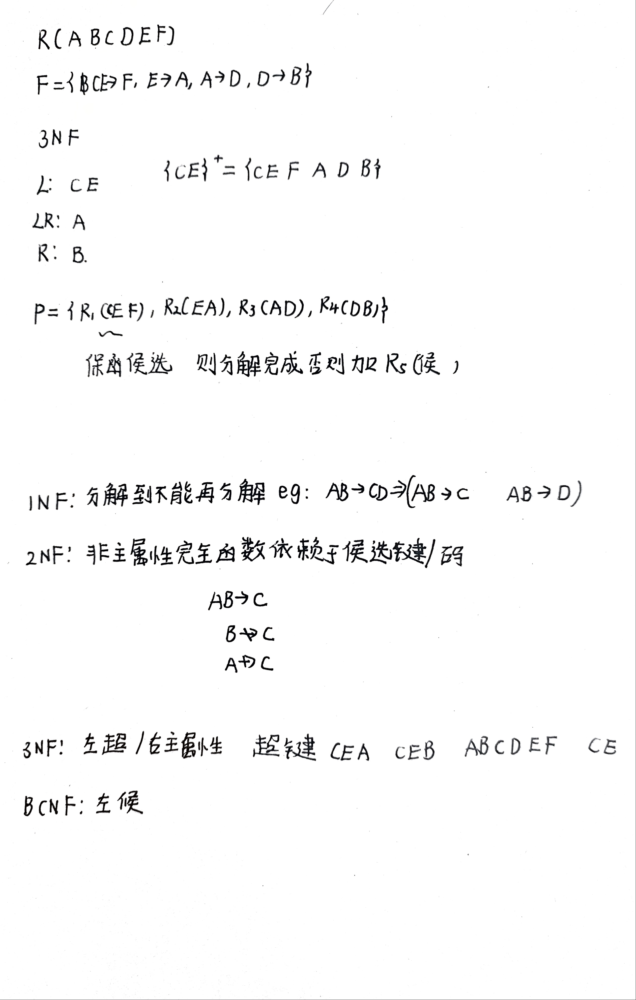
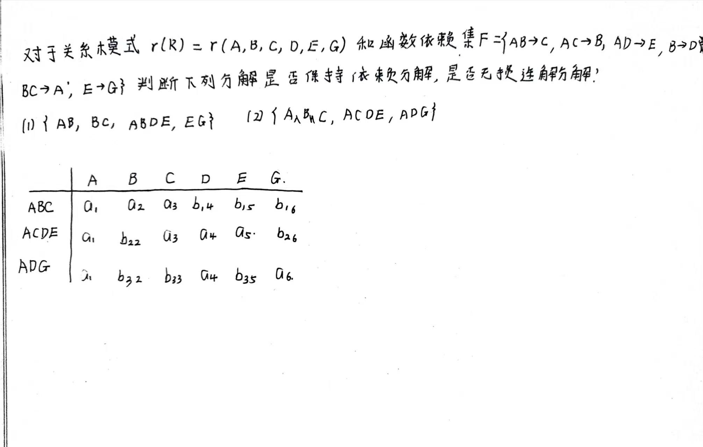
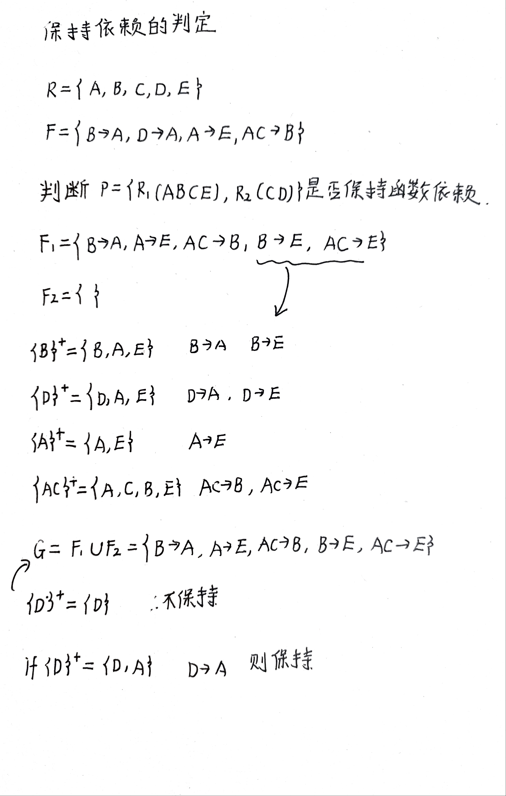
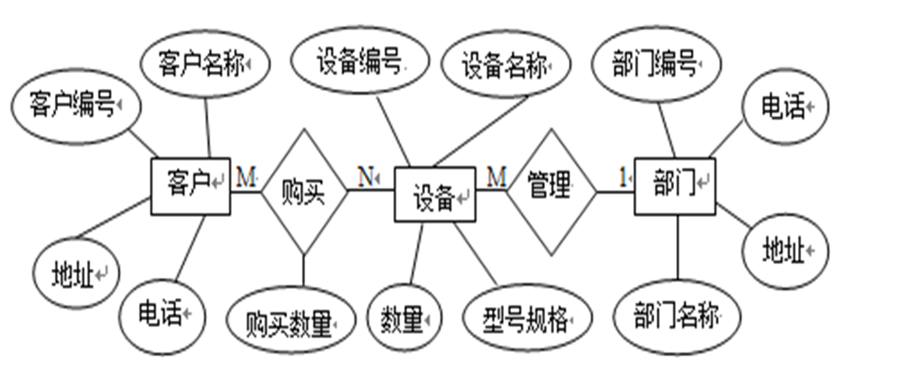
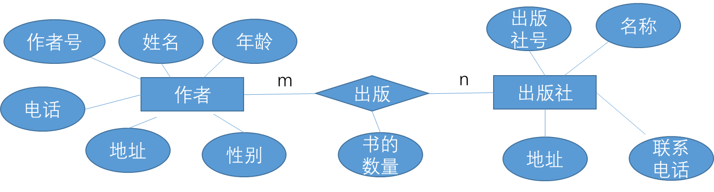

## 数据库的内部结构

[原文链接](https://blog.csdn.net/qq_42192693/article/details/109552053)

### 三级模式结构

（1）外模式/子模式/用户模式 ： 是用户观念下局部数据结构的逻辑描述，是数据库用户（包括应用程序员和最终用户）能够看见和使用的局部数据的逻辑结构和特征的描述。

**一个数据库可以有多个外模式**

（2）概念模式/模式 ：是对数据库全局逻辑结构的描述，**是数据库所有用户的公共数据视图**。模式的描述：①所有实体、实体的属性和实体间的联系。②数据的约束。③数据的语义信息。④安全性和完整性信息。

**概念模式的地位**：是数据库系统模式结构的中间层；与数据的物理存储细节和硬件环境无关；与具体的应用程序、开发工具及高级程序设计语言无关

**一个数据库只有一个概念模式**

（3）内模式/存储模式/物理模式 ：是对数据库中数据物理结构和存储方式的描述，是数据在数据库内部的表示形式。

内部模式定义了所有内部记录类型、索引和文件的组织方式，以及所有数据控制方面的细节（包括数据是否压缩存储、数据是否加密）。内模式是DBMS管理的最低层。虽然称其为物理模式，但它不涉及物理记录的形式，如物理块或页、具体设备的柱面与磁道大小等，内部视图仍然不是物理层，是最接近物理存储的数据存储方式，是物理存储设备上存储数据时的物理抽象。

**一个数据库只有一个内模式**

### 两级映像功能

（1）外模式/模式映像
（2）模式/内模式映像

## 完整性规则

[数据库闭包与候选码](https://www.cnblogs.com/gulvzhe/archive/2013/05/24/3096913.html)

[最小函数依赖集](https://blog.csdn.net/ysy1119/article/details/134481132)

!!! note
    会举例说明

**实体完整性**：主码的值不能为空且必须唯一（作用：保证表中的每一条数据都能够被识别）

**参照完整性**：外码的值要么等于参照表中的主码的值，要么为空（作用：保证表之间关联数据的一致性，防止 “孤儿数据”。）

**用户自定义完整性**：根据用户定义的

## 并发问题与事务隔离级别

1. 并发会带来那些问题？
2. 事务的隔离级别有哪些？
3. 各种隔离级别有哪些优缺点？如何选择？

脏读，幻读，丢失修改，不可重复读

### 丢失修改

**定义**：两个事务同时读取同一数据，然后分别基于原始值进行修改，后提交的事务覆盖了先提交的修改。

### 脏读

**定义**：一个事务读取了另一个未提交事务写入的数据。如果后来那个事务回滚，读到的数据就是无效的。

### 不可重复读

**定义**：同一事务内，两次读取同一行数据，期间另一个事务修改并提交了该行，导致两次结果不同。

### 幻读

**定义**：同一事务内，两次执行同一个范围查询，期间另一个事务插入/删除满足条件的新行，导致第二次查询返回不同的行集。

| 隔离级别 | 脏读 | 不可重复读 | 幻读 | 丢失修改 |
| ---- | ---- | ---- | ---- | ---- |
| 读未提交 | 可能 | 可能 | 可能 |  |
| 读已提交 | 不会 | 可能 | 可能 |  |
| 可重复读 | 不会 | 不会 | 可能 | MySQL InnoDB 默认级别 |
| 串行化 | 不会 | 不会 | 不会 | 最高级别 |


## mysqldump数据库的备份

[mysqldump操作手册]([mysqldump 操作手册mysqldump 命令使用文档 1. 命令概述 mysqldump 是 MySQL 官方提 - 掘金](https://juejin.cn/post/7553582001426530331))

```bash
# 备份整个数据库
# 这种方式到处的备份不具有创建数据库的语句，还原的时候需要自己先创建一个空的数据库
mysqldump -uroot -p database_name > file_name.sql

# 备份指定的表
mysqldump -uroot -p database_name table_name1 table_name2 > file_name.sql

# 备份多个数据库
# 该方式导出的数据库，还原的时候不需要创建空的数据库
mysqldump -uroot -p --databases db1 db2 > file_name.sql

# 备份所有数据库
mysqldump -uroot -p --all-databases > file_name.sql

# 还原数据库
mysql -uroot -p 数据库名 < backup.sql

# 只备份数据库结构
mysqldump -uroot -p -d database_name > struct_only.sql # -d 或者 --no-data参数
# 只备份数据
mysqldump -uroot -p -t database_name > data_only.sql # -t 或者 --no-create-info
```

!!! note
    注意没有指定输出的文件的路径会直接输出到当前（执行命令）的目录

## 关系代数

## SQL语句

## 函数依赖与范式

[函数依赖讲解](https://blog.csdn.net/Jeremy_Tsang/article/details/108949656)

完全函数依赖

部分函数依赖

传递函数依赖（了解）

2NF的分解算法

### 范式级别判定

注意范式等级判定应该从高到低进行判定



### 无损连接判定



### 保持依赖的判定

判定方法：
1. 检查原关系模式中的每个函数依赖，确保函数依赖的左右两边的属性都在同一个被分解的关系模式中。
2. 如果所有的函数依赖都能在某个分解后的关系模式中找到，则分解保持了函数依赖。

例如，如果关系模式R中存在函数依赖A -> B，且在分解后的关系模式R1中同时包含了属性A和B，则可以说分解保持了函数依赖。

[例题：](https://www.bilibili.com/video/BV1Vj411u7cS/?spm_id_from=333.337.search-card.all.click&vd_source=d54d05755e9a6b6ed65719abeda95702)




## ER图与模式转换

!!! note
    需要知道ER图的画法，ER图如何转换成关系模式

实体类型之间的关系

1. 一对一(1:1)
2. 一对多(1:n)
3. 多对多(m:n)

实体型用矩形表示，属性用椭圆表示，联系用菱形表示，联系可以具有属性

转换成关系模式的时候，主键可以用下划线标注，外键可以注明

确定关系名：实体，m:n属性

确定每个关系的属性

实体名：自己的属性+对面为1关系实体的主键
关系名：自己的属性+两边的主键

确定主键



转换成的关系模式如下：

```txt
客户（客户名称，客户编号，地址，电话）
设备（设备编号，设备名称，数量，型号规格）
部门（部门编号，部门名称，电话，地址）

正确答案：
客户（客户编号，客户名称，地址，电话）
设备（设备编号，设备名称，数量，型号规格，部门编号）
部门（部门编号，部门名称，电话，地址）
购买（客户编号，设备编号，购买数量）

我的答案：
1. 客户(客户编号, 客户名称, 地址, 电话)，主键：客户编号
2. 部门(部门编号, 部门名称, 地址, 电话)，主键：部门编号
3. 设备(设备编号, 设备名称, 型号规格, 数量, 部门编号)，主键：设备编号，外键：部门编号 参照 部门(部门编号)
4. 购买(客户编号, 设备编号, 购买数量)，主键：(客户编号, 设备编号)，外键：客户编号 参照 客户(客户编号)，设备编号 参照 设备(设备编号)
```

题目二：现有一局部应用，包括两个实体：出版社和作者，这两个实体是多对多的联系。试设计适当的属性，画出E-R图，将其转换为关系模型（关系名、属性名、码和完整性约束条件）


```txt
作者（作者号，姓名，年龄，性别，电话，地址）
出版社（出版社号，名称，地址，联系电话）
出版（作者号，出版社号，书的数量）

出版关系的外码作者号参照作者关系的主码作者号，
出版关系的外码出版社号参照出版社关系的主码出版社号
```

题目三：某医院需要上线住院信息管理系统，请完成以下两方面工作。（1）基本的需求分析为：一个科室有多个病房、多个医生；一个病房只能属于一个科室；一个医生只属于一个科室；一个医生可负责多个病人的诊治，但一个医生的主治医生只有一个。画出对应的E-R图。（2）请将E-R图转换为对应的关系模式，各关系模式属于第几范式？会产生什么更新异常？